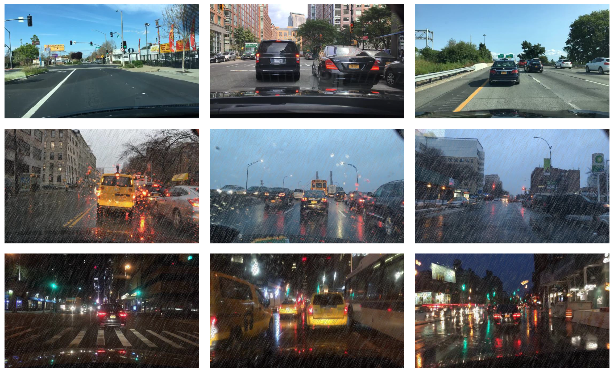

# ICCV2021 Vector-Decomposed Disentanglement
Vector-Decomposed Disentanglement for Domain-Invariant Object Detection

### Datasets

#### Daytime-Sunny, Dusk-Rainy, and Night-Rainy

[[Download link](https://1drv.ms/u/s!Aj36fTfndfoAgkgoOBNOruhwdPls?e=U6AGWP)]

[[Models](https://1drv.ms/u/s!Aj36fTfndfoAgkm7nRpm3hmXaiw8?e=CfLb97)]

Based on [BDD-100k dataset](https://bdd-data.berkeley.edu), we construct three datasets with different weather conditions. Particularly, Daytime-Sunny contains 27,708 daytime-sunny images. Dusk-Rainy contains 3,501 images. Night-Rainy contains 2,494 images.



### Training

CUDA_VISIBLE_DEVICES=4 python da_train_net_gl.py --max_epochs 20 --cuda --dataset dc --dataset_t nr --bs 1 --da_use_contex --lc --gc

### Testing

CUDA_VISIBLE_DEVICES=4 python test_SW_ICR_CCR_gl.py --cuda --modelname output_path --dataset nr --gc --lc --model_dir model_name

## Citation

If you find this repository useful for your work, please cite as follows:

```
@article{wu2021vector,
  title={Vector-Decomposed Disentanglement for Domain-Invariant Object Detection},
  author={Wu, Aming and Liu, Rui and Han, Yahong and Zhu, Linchao and Yang, Yi},
  journal={IEEE International Conference on Computer Vision (ICCV)},
  year={2021}
}

```
